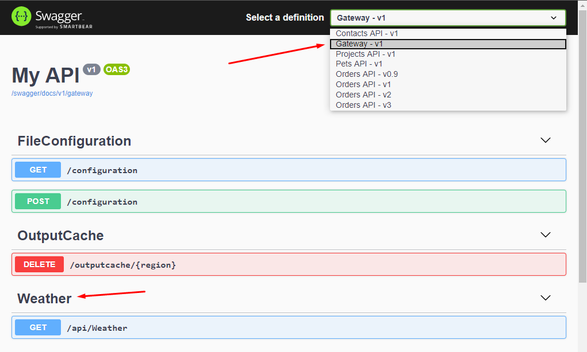
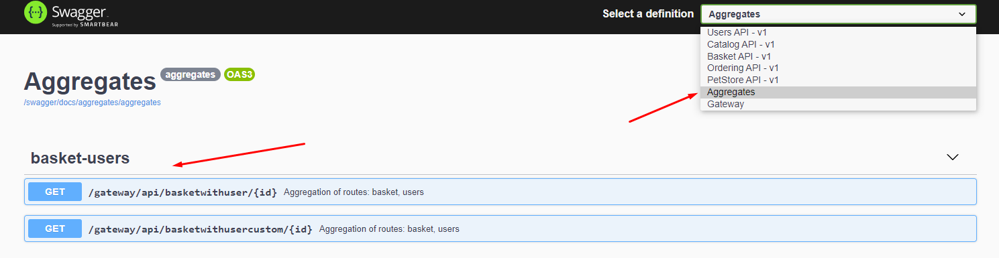

**SwaggerForOcelot** combines two amazing projects **[Swashbuckle.AspNetCore](https://github.com/domaindrivendev/Swashbuckle.AspNetCore)** and **[Ocelot](https://github.com/ThreeMammals/Ocelot)**. Allows you to view and use swagger documentation for downstream services directly through the Ocelot project.

Direct via `http://ocelotprojecturl:port/swagger` provides documentation for downstream services configured in `ocelot.json`. Additionally, the addresses are modified to match the `UpstreamPathTemplate` from the configuration.


---
Did this project help you? [You can now buy me a beer 😎🍺.](https://www.buymeacoffee.com/0dQ7tNG)

[](https://www.buymeacoffee.com/0dQ7tNG)

## Get Started

1. Configure SwaggerGen in your downstream services.
   > Follow the [SwashbuckleAspNetCore documentation](https://github.com/domaindrivendev/Swashbuckle.AspNetCore#getting-started).
2. Install Nuget package into yout ASP.NET Core Ocelot project.
   > dotnet add package MMLib.SwaggerForOcelot
3. Configure SwaggerForOcelot in `ocelot.json`.

```Json
 {
  "Routes": [
    {
      "DownstreamPathTemplate": "/api/{everything}",
      "DownstreamScheme": "http",
      "DownstreamHostAndPorts": [
        {
          "Host": "localhost",
          "Port": 5100
        }
      ],
      "UpstreamPathTemplate": "/api/contacts/{everything}",
      "UpstreamHttpMethod": [ "Get" ],
      "SwaggerKey": "contacts"
    },
    {
      "DownstreamPathTemplate": "/api/{everything}",
      "DownstreamScheme": "http",
      "DownstreamHostAndPorts": [
        {
          "Host": "localhost",
          "Port": 5200
        }
      ],
      "UpstreamPathTemplate": "/api/orders/{everything}",
      "UpstreamHttpMethod": [ "Get" ],
      "SwaggerKey": "orders"
    }
  ],
  "SwaggerEndPoints": [
    {
      "Key": "contacts",
      "Config": [
        {
          "Name": "Contacts API",
          "Version": "v1",
          "Url": "http://localhost:5100/swagger/v1/swagger.json"
        }
      ]
    },
    {
      "Key": "orders",
      "Config": [
        {
          "Name": "Orders API",
          "Version": "v0.9",
          "Url": "http://localhost:5200/swagger/v0.9/swagger.json"
        },
        {
          "Name": "Orders API",
          "Version": "v1",
          "Url": "http://localhost:5200/swagger/v1/swagger.json"
        },
        {
          "Name": "Orders API",
          "Version": "v2",
          "Url": "http://localhost:5200/swagger/v2/swagger.json"
        },
        {
          "Name": "Orders API",
          "Version": "v3",
          "Url": "http://localhost:5200/swagger/v3/swagger.json"
        }
      ]
    }
  ],
  "GlobalConfiguration": {
    "BaseUrl": "http://localhost"
  }
}
```

   > `SwaggerEndPoint` is configuration for downstream service swagger generator endpoint. Property `Key` is used to pair with the Route configuration. `Name` is displayed in the combobox. `Url` is downstream service swagger generator endpoint.

4. In the `ConfigureServices` method of `Startup.cs`, register the SwaggerForOcelot generator.

```CSharp
services.AddSwaggerForOcelot(Configuration);
```

5. In `Configure` method, insert the `SwaggerForOcelot` middleware to expose interactive documentation.

```CSharp
app.UseSwaggerForOcelotUI(opt => {
  opt.PathToSwaggerGenerator = "/swagger/docs";
})
```

   You can optionally include headers that your Ocelot Gateway will send when requesting a swagger endpoint. This can be especially useful if your downstream microservices require contents from a header to authenticate.

  ```CSharp
app.UseSwaggerForOcelotUI(opt => {
    opt.DownstreamSwaggerHeaders = new[]
    {
        new KeyValuePair<string, string>("Auth-Key", "AuthValue"),
    };
})
  ```

  After swagger for ocelot transforms the downstream swagger to the upstream swagger, you have the ability to alter the upstream swagger if you need to by setting the `ReConfigureUpstreamSwaggerJson` option or `ReConfigureUpstreamSwaggerJsonAsync` option for async methods.

  ```CSharp
public string AlterUpstreamSwaggerJson(HttpContext context, string swaggerJson)
{
    var swagger = JObject.Parse(swaggerJson);
    // ... alter upstream json
    return swagger.ToString(Formatting.Indented);
}

app.UseSwaggerForOcelotUI(opt => {
    opt.ReConfigureUpstreamSwaggerJson = AlterUpstreamSwaggerJson;
})
  ```
You can optionally customize the swagger server prior to calling the endpoints of the microservices as follows:
```CSharp
app.UseSwaggerForOcelotUI(opt => {
    opt.ReConfigureUpstreamSwaggerJson = AlterUpstreamSwaggerJson;
    opt.ServerOcelot = "/siteName/apigateway" ;
})
  ```

6. Show your microservices interactive documentation.

   > `http://ocelotserviceurl/swagger`

## Open API Servers

If you have multiple servers defined in the downstream service Open API documentation, or you use server templating and you want to use it on the gateway side as well, then you must explicitly enable it on the Swagger endpoint definition by setting property `TakeServersFromDownstreamService` to `true`.

```json
"SwaggerEndPoints": [
    {
      "Key": "users",
      "TakeServersFromDownstreamService": true,
      "Config": [
        {
          "Name": "Users API",
          "Version": "v1",
          "Service": {
            "Name": "users",
            "Path": "/swagger/v1/swagger.json"
          }
        }
      ]
    }
]
```

> ⚠ If you set `TakeServersFromDownstreamService` to `true`, then the server path is not used to transform the paths of individual endpoints.

## Virtual directory

If you have a `downstream service` hosted in the virtual directory, you probably have a `DownstreamPathTemplate` starting with the name of this virtual directory `/virtualdirectory/api/{everything}`. In order to properly replace the paths, it is necessary to set the property route `"Virtualdirectory":"/virtualdirectory"`.

Example:

``` Json
 {
  "DownstreamPathTemplate": "/project/api/{everything}",
  "DownstreamScheme": "http",
  "DownstreamHostAndPorts": [
      {
      "Host": "localhost",
      "Port": 5100
      }
  ],
  "UpstreamPathTemplate": "/api/project/{everything}",
  "UpstreamHttpMethod": [ "Get" ],
  "SwaggerKey": "project",
  "VirtualDirectory":"/project"
}
```

## Service discovery

If you use [Ocelot Service Discovery Provider](https://ocelot.readthedocs.io/en/latest/features/servicediscovery.html) to find the host and port for the downstream service, then you can use the same service name for swagger configuration.

``` Json
"Routes": [
  {
    "DownstreamPathTemplate": "/api/{everything}",
    "ServiceName": "projects",
    "UpstreamPathTemplate": "/api/project/{everything}",
    "SwaggerKey": "projects",
  }
],
 "SwaggerEndPoints": [
    {
      "Key": "projects",
      "Config": [
        {
          "Name": "Projects API",
          "Version": "v1",
          "Service": {
            "Name": "projects",
            "Path": "/swagger/v1/swagger.json"
          }
        }
      ]
    }
  ],

  "GlobalConfiguration": {
    "ServiceDiscoveryProvider": {
      "Type": "AppConfiguration",
      "PollingInterval": 1000
    }
  }
```

## The Gateway documentation itself

There are several real scenarios when you need to have a controller directly in your gateway. For example: specific aggregation of results from multiple services / legacy part of your system / ...

If you need to, you can also add documentation.

1. Allow `GenerateDocsForGatewayItSelf` option in configuration section.

```CSharp
services.AddSwaggerForOcelot(Configuration,
  (o) =>
  {
      o.GenerateDocsForGatewayItSelf = true;
  });
```

or you can provide more options for gateway itself documentation

```CSharp
services.AddSwaggerForOcelot(Configuration,
  (o) =>
  {
      o.GenerateDocsForGatewayItSelf(opt =>
      {
          opt.FilePathsForXmlComments = { "MyAPI.xml" };
          opt.DocumentFilter<MyDocumentFilter>();
          opt.AddSecurityDefinition("Bearer", new OpenApiSecurityScheme()
          {
              Description = @"JWT Authorization header using the Bearer scheme. Enter 'Bearer' [space] and then your token in the text input below. Example: 'Bearer 12345abcdef'",
              Name = "Authorization",
              In = ParameterLocation.Header,
              Type = SecuritySchemeType.ApiKey,
              Scheme = "Bearer"
          });
          opt.AddSecurityRequirement(new OpenApiSecurityRequirement()
          {
              {
                  new OpenApiSecurityScheme
                  {
                      Reference = new OpenApiReference
                      {
                          Type = ReferenceType.SecurityScheme,
                          Id = "Bearer"
                      },
                      Scheme = "oauth2",
                      Name = "Bearer",
                      In = ParameterLocation.Header,
                  },
                  new List<string>()
              }
          });
      });
  });
```

2. Use Swagger generator in `Configure` section.

```csharp
app.UseSwagger();
```



## Documentation of Ocelot Aggregates

You are probably familiar with Ocelot great feature [***Request Aggregation***](https://ocelot.readthedocs.io/en/latest/features/requestaggregation.html). Request Aggregation allows you to easily add a new endpoint to the gateway that will aggregate the result from other existing endpoints.
If you use these aggregations, you would probably want to have these endpoints in the api documentation as well.

📢 From version `3.0.0` you can use this package for generating documentation for Ocelot aggregates.

In `ConfigureServices` allow `GenerateDocsForAggregates` option.

```CSharp
services.AddSwaggerForOcelot(Configuration,
  (o) =>
  {
      o.GenerateDocsForAggregates = true;
  });
```

Documentations of your aggregates will be available on custom page **Aggregates**.


The current implementation may not cover all scenarios *(I hope most of them)*, but there are several ways you can change the final documentation.

### Custom description

By default, this package generate description from downstream documentation. If you want add custom description for your aggregate route, you can add description to `ocelot.json`.

```json
"Aggregates": [ 
  {
    "RouteKeys": [
      "user",
      "basket"
    ],
    "Description": "Custom description for this aggregate route.",
    "Aggregator": "BasketAggregator",
    "UpstreamPathTemplate": "/gateway/api/basketwithuser/{id}"
  }
]
```

### Different parameter names

It is likely that you will have different parameter names in the downstream services that you are aggregating. For example, in the User service you will have the `{Id}` parameter, but in the Basket service the same parameter will be called `{BuyerId}`. In order for Ocelot aggregations to work, you must have parameters named the same in Ocelot configurations, but this will make it impossible to find the correct documentation.

Therefore, you can help the configuration by setting parameter name map.

```json
{
  "DownstreamPathTemplate": "/api/basket/{id}",
  "UpstreamPathTemplate": "/gateway/api/basket/{id}",
  "ParametersMap": {
    "id": "buyerId"
  },
  "ServiceName": "basket",
  "SwaggerKey": "basket",
  "Key": "basket"
}
```

Property `ParametersMap` is map, where `key` *(first parameter)* is the name of parameter in Ocelot configuration and `value` *(second parameter)* is the name of parameter in downstream service.

### Custom aggregator

The response documentation is generated according to the rules that Ocelot uses to compose the response from the aggregate. If you use your custom `IDefinedAggregator`, your result may be different. In this case you can use `AggregateResponseAttibute`.

```CSharp
[AggregateResponse("Basket with buyer and busket items.", typeof(CustomResponse))]
public class BasketAggregator : IDefinedAggregator
{
    public async Task<DownstreamResponse> Aggregate(List<HttpContext> responses)
    {
        ...
    }
}
```

### Modifying the generated documentation

If you do not like the final documentation, you can modify it by defining your custom postprocessor.

```CSharp
services.AddSwaggerForOcelot(Configuration,
  (o) =>
  {
      o.GenerateDocsForAggregates = true;
      o.AggregateDocsGeneratorPostProcess = (aggregateRoute, routesDocs, pathItemDoc, documentation) =>
      {
          if (aggregateRoute.UpstreamPathTemplate == "/gateway/api/basketwithuser/{id}")
          {
              pathItemDoc.Operations[OperationType.Get].Parameters.Add(new OpenApiParameter()
              {
                  Name = "customParameter",
                  Schema = new OpenApiSchema() { Type = "string"},
                  In = ParameterLocation.Header
              });
          }
      };
  });
```

### If none of this is enough

🙏 Feel free to provide a PR with implementation of your scenario. You will probably help many others.

## Merging configuration files

Optionally you can use the Ocelot feature [Merging configuration files](https://ocelot.readthedocs.io/en/latest/features/configuration.html#merging-configuration-files) to load the apigateway configuration from multiple configuration files named as follows: `ocelot.exampleName.json`. To activate this feature you need to use the following extension:

```CSharp
WebHost.CreateDefaultBuilder(args)
  .ConfigureAppConfiguration((hostingContext, config) =>
  {
      config.AddOcelotWithSwaggerSupport();
  })
  .UseStartup<Startup>();
```

Using this extension the swagger path settings must be in a file called: `ocelot.SwaggerEndPoints.json`. If instead you want to use another name for this file you could set the name as follows _(without the .json extension)_:

```CSharp
WebHost.CreateDefaultBuilder(args)
  .ConfigureAppConfiguration((hostingContext, config) =>
  {
     config.AddOcelotWithSwaggerSupport((o) => {
       o.FileOfSwaggerEndPoints = "ocelot.swagger";
     })
  })
  .UseStartup<Startup>();
```

Optionally you can put the configuration files in a folder, and for that you have to set the extension as follows:

```CSharp
WebHost.CreateDefaultBuilder(args)
  .ConfigureAppConfiguration((hostingContext, config) =>
  {
    config.AddOcelotWithSwaggerSupport((o) => {
      o.Folder = "Configuration";
    });
  })
  .UseStartup<Startup>();
```

Optionally you can also add configuration files with the format `ocelot.exampleName.json` per environment, to use this functionality you must configure the extension as follows:

```CSharp
WebHost.CreateDefaultBuilder(args)
  .ConfigureAppConfiguration((hostingContext, config) =>
  {
    config.AddOcelotWithSwaggerSupport((o) => {
      o.Folder = "Configuration";
      o.Environment = hostingContext.HostingEnvironment;
    });
  })
  .UseStartup<Startup>();
```

To save the primary Ocelot config file under a name other than `ocelot.json then use the following:

```CSharp
WebHost.CreateDefaultBuilder(args)
  .ConfigureAppConfiguration((hostingContext, config) =>
  {
    config.AddOcelotWithSwaggerSupport((o) => {
      o.PrimaryOcelotConfigFile = "myOcelot.json";
    });
  })
  .UseStartup<Startup>();
```

## Control downstream to swagger api
With the `ISwaggerDownstreamInterceptor` interface you are able to inject your own logic to control the downstream.

1. In the ConfigureServices method of Startup.cs, register your downstream interceptor along with your other dependencies.
```CSharp
services.AddSingleton<ISwaggerDownstreamInterceptor, PublishedDownstreamInterceptor>();
services.AddSingleton<ISwaggerEndpointConfigurationRepository, DummySwaggerEndpointRepository>();
```

2. In your downstream interceptor add your custom logic to control if the downstream should be done.
```CSharp
public class PublishedDownstreamInterceptor : ISwaggerDownstreamInterceptor
{
    private readonly ISwaggerEndpointConfigurationRepository _endpointConfigurationRepository;

    public PublishedDownstreamInterceptor(ISwaggerEndpointConfigurationRepository endpointConfigurationRepository)
    {
        _endpointConfigurationRepository = endpointConfigurationRepository;
    }

    public bool DoDownstreamSwaggerEndpoint(HttpContext httpContext, string version, SwaggerEndPointOptions endPoint)
    {
        var myEndpointConfiguration = _endpointConfigurationRepository.GetSwaggerEndpoint(endPoint, version);

        if (!myEndpointConfiguration.IsPublished)
        {
            httpContext.Response.StatusCode = 404;
            httpContext.Response.WriteAsync("This enpoint is under development, please come back later.");
        }

        return myEndpointConfiguration.IsPublished;
    }
}
```

Note, the service is still visible in the swagger ui the response is only visible in the request to the downstream url.
If you want to control the visibility of the endpoints as well you have to implement a custom swagger ui.

## Security definition generation

It is possible to generate security definitions for the enpoints based on Ocelot configuration

1. Add `AuthenticationOptions` to your route definition
``` Json
"Routes": [
  {
    "DownstreamPathTemplate": "/api/{everything}",
    "ServiceName": "projects",
    "UpstreamPathTemplate": "/api/project/{everything}",
    "SwaggerKey": "projects",
    "AuthenticationOptions": {
      "AuthenticationProviderKey": "Bearer",
      "AllowedScopes": [ "scope" ]
    },
  }
]
```

2. Provide a mapping in Startup between `AuthenticationProviderKey` and it's corresponding `securityDefintion`
```CSharp
services.AddSwaggerForOcelot(Configuration,
  (o) =>
  {
    o.AddAuthenticationProviderKeyMapping("Bearer", "appAuth");
  });
```

3. Now you should have security definitions on your swagger documents
``` Json
{
  "paths": {
    "/api/project": {
      "get": {
        ...
        "security": [
          {
            "appAuth": [ "scope" ]
          }
        ]
      }
    }
  }
}
```

Note, this does not affect nor checks the swagger document's `securityDefinitions` property.

## Limitation

- Now, this library support only `{everything}` as a wildcard in routing definition. #68
- This package unfortunately does not support parameter translating between upstream and downstream path template. #59

## Version 2.0.0

This version is breaking change. Because support Ocelot 16.0.0, which rename `ReRoutes` to `Routes`. See Ocelot [v16.0.0](https://github.com/ThreeMammals/Ocelot/releases/tag/16.0.0).
